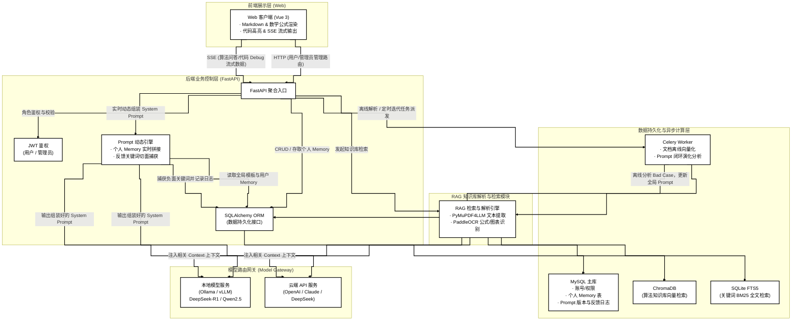
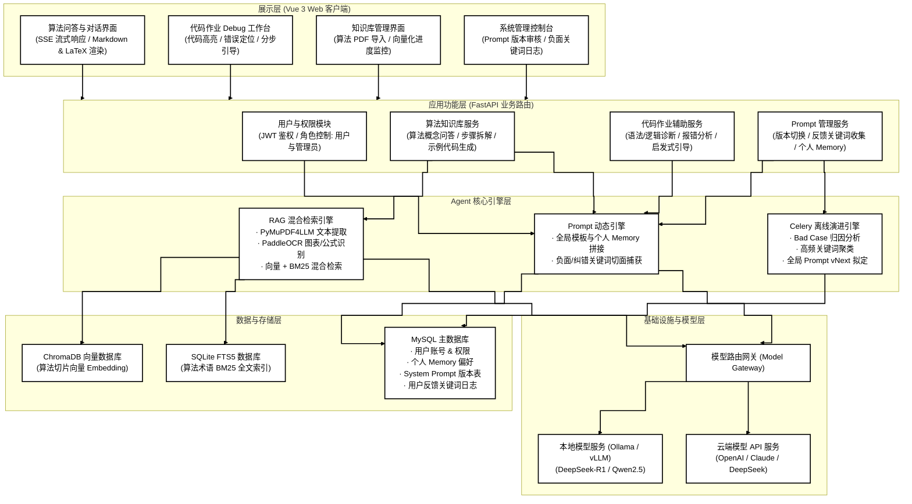
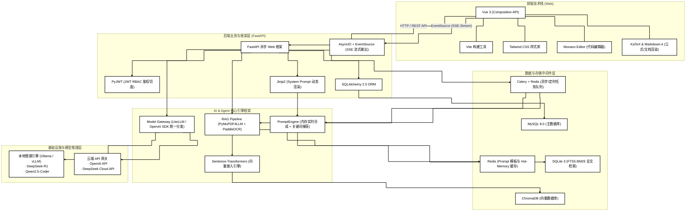
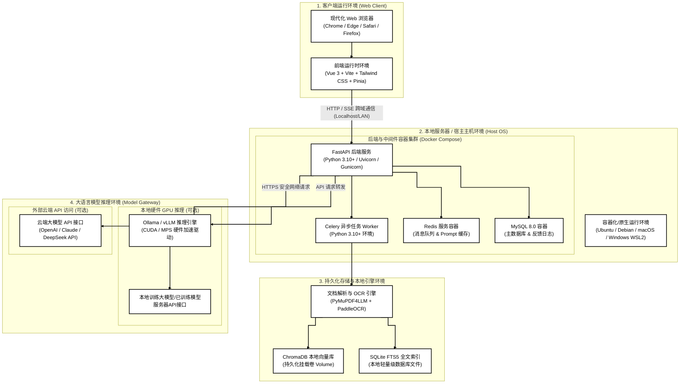
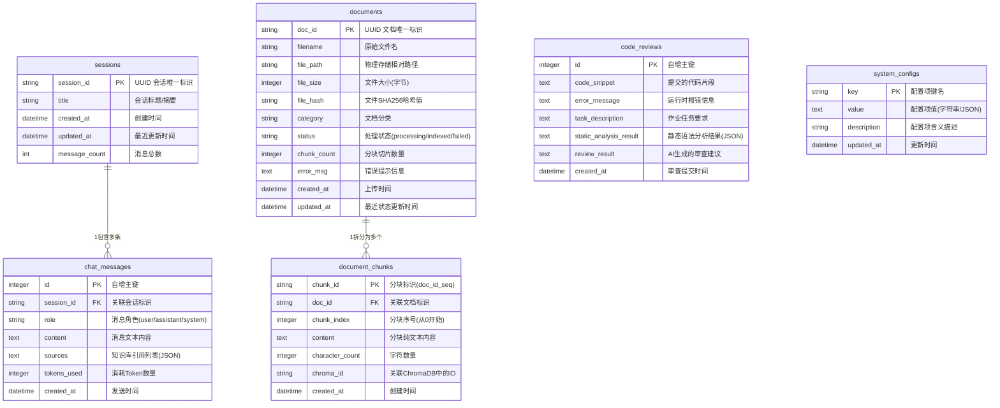

# 基于RAG技术的经典人工智能算法智能辅导与错误诊断辅助学习系统的概要设计说明书

**项目名称** 基于RAG技术的经典人工智能算法智能辅导与错误诊断辅助学习系统

**文档状态** []草稿文档

**当前版本** v1.0.0

**作者** PasteK0n

**完成日期** 

**版权所有** PasteK0n@github.com

---

# 修改历史

| 日期       | 版本   | 作者           | 修改内容                                                     | 评审号 | 更改请求号 |
| :--------- | :----- | :------------- | :----------------------------------------------------------- | :----- | :--------- |
| 2026-08-06 | V1.0.0 | PasteK0n       | 基本框架制定与内容撰写                             | R-001  | CR-001       |

---

## 目录

- [修改历史](#修改历史)
- [一、 引言 (Introduction)](#一-引言-introduction)
  - [1.1 编写目的](#11-编写目的)
  - [1.2 文档范围](#12-文档范围)
  - [1.3 参考资料](#13-参考资料)
- [二、系统总体设计 (System Total Design)](#二-系统总体设计-system-total-design)
  - [2.1 整体架构](#21-整体架构)
  - [2.2 整体功能架构](#22-整体功能架构)
  - [2.3 整体技术架构](#23-整体技术架构)
  - [2.4 运行环境设计](#24-运行环境设计)
  - [2.5 设计目标](#25-设计目标)
- [三、系统功能模块设计 (System Function Module Design)](#三-系统功能模块设计-system-function-module-design)
  -[3.1 人工智能经典算法知识库模块设计](#31-人工智能经典算法知识库模块设计)
  -[3.2 Python代码作业辅助模块设计](#32-Python代码作业辅助模块设计)
  -[3.3 Prompt合成构建模块设计](#33-Prompt合成构建模块设计)
  -[3.4 代码轻量运行模块设计](#34-代码轻量运行模块设计)
  -[3.5 模型训练模块设计](#35-模型训练模块设计)
  -[3.6 可视化模块设计](#36-可视化模块设计)
  -[3.7 效果评测模块设计](#37-效果评测模块设计)
- [四、性能设计 (Performance Design)](#四-性能设计-performance-design)
  -[4.1 LLM/RAG智能引擎指标](#41-LLM/RAG智能引擎指标)
  -[4.2 响应感知与本地资源控制](#42-响应感知与本地资源控制)
- [五、接口设计 (API Design)](#五-接口设计-API-design)
  -[5.1 RAG问答接口](#51-RAG问答接口)
  -[5.2 代码审查接口](#52-代码审查接口)
  -[5.3 知识库管理接口](#53-知识库管理接口)
  -[5.4 系统配置接口](#54-系统配置接口)
  -[5.5 前后端连接检测接口](#55-前后端连接检测接口)
- [六、数据库设计 (Database Design)](#六-数据库设计-database-design)
  -[6.1 实体关系图](#61-实体关系图)
  -[6.2 物理数据表结构详解](#62-物理数据表结构详解)
  -[6.3 向量数据库设计](#63-向量数据库设计)
- [七、出错处理与可靠性设计 (Reliability & Fault-Tolerance)](#七-出错处理与可靠性设计-reliability-&-fault-tolerance)

---
## 一、引言
### 1.1 编写目的

本文档是“基于RAG技术的经典人工智能算法与错误诊断辅助学习系统”的概要设计说明书。编写文档的目的在于：

1. 设计系统整体架构，为开发者提供简洁明了的系统构成；
2. 设计系统功能模块、接口与数据库，达成目标功能；
3. 进行出错处理与可靠性设计，提高系统稳定性。

### 1.2 文档范围

本文档涵盖该AI搭建系统的构建过程，包括：

* **引言与总体设计**：项目设立初衷和系统整体架构设计
* **功能模块与性能设计**：不同用户界面包含功能，以及系统需要达到性能标准
* **接口、数据库与可靠性设计**：设计前后端交互接口、基于RAG的人工智能算法数据库，以及增强系统鲁棒性

### 1.3 参考资料

1.  GB/T 8567-2006《计算机软件文档编制规范》，中华人民共和国国家质量监督检验检疫总局，2006年
2.  ChromaDB 高维向量检索持久化规范：https://docs.trychroma.com/
3.  《Retrieval-Augmented Generation for Large Language Models: A Survey》, Tongxiang Fan, et al., 2023.

## 二、系统整体设计
### 2.1 整体架构

本系统面向个人自主学习与辅助，采用“前端 Web + 本地后端 + 本地/云端混合大模型”的架构。系统通过 FastAPI 整合 RAG（检索增强生成） 知识库与 代码作业辅助 Agent，并结合 Prompt 动态引擎 实现全局能力迭代与个人学习偏好记忆的实时合成。



### 2.2 整体功能架构

本系统实现以下功能：
1. 搭建基于RAG的人工智能经典算法数据库
2. Python代码辅助
3. Prompt动态合成与演化
4. Agent搭建与web界面前端展示



### 2.3 整体技术架构

本系统前端采用 Vue 3 + Vite + Tailwind CSS 搭配 SSE 实现响应式的 Markdown/LaTeX 渲染与代码流式输出；后端基于 FastAPI 搭建高并发路由并集成 JWT 权限控制，采用 Jinja2 实现“全局 Prompt 模板 + 用户 Memory”的动态合成；数据持久化由 MySQL + SQLAlchemy ORM 承载，配合 Redis + Celery 处理文档异步向量化与离线 Prompt 闭环演化分析；知识库检索整合 PyMuPDF4LLM + PaddleOCR 进行文档解析，采用 ChromaDB（向量检索）+ SQLite FTS5（BM25 全文检索） 的混合检索架构；模型层通过 Model Gateway 实现了对本地 Ollama（如 DeepSeek-R1 / Qwen2.5） 与外部云端 API 的无缝切换与统一调度。


### 2.4 运行环境设计

本系统的运行环境设计兼顾本地部署简单性与资源可扩展性，主要分为四层：

1. **客户端环境**：无需安装独立客户端，用户通过任意现代 Web 浏览器即可访问基于 Vue 3 + Vite 构建的前端 Web 应用，支持流式 Markdown、LaTeX 公式和代码渲染。
2. **后端容器化环境**：通过 Docker Compose 快速编排本地应用环境，包含基于 Python 3.10+ 的 FastAPI 异步后端框架、Celery Worker 任务执行器、Redis 8.0 消息队列与缓存，以及 MySQL 8.0 关系型数据库。
3. **存储与 RAG 解析环境**：依赖本地挂载卷实现数据持久化，嵌入 PyMuPDF4LLM 与 PaddleOCR 运行时解析 PDF 算法文档，并通过 ChromaDB 本地向量库与 SQLite FTS5 实现高性能混合检索。
4. **模型推理环境（灵活双模式）**：
  * **本地硬件推理模式**：宿主机搭载 NVIDIA GPU时，可通过 Ollama / vLLM 本地加载本地训练模型（可采用服务器端API）运行；
  * **轻量云端模式**：无独立显存设备时，仅依赖 Python 基础环境，通过网络直接接入外部云端模型 API 运行。



### 2.5 设计目标

本系统的核心设计目标在于构建一个**安全可控、具备自我进化能力的私有化 AI 教学与作业辅助平台**。系统在功能上聚焦于**人工智能经典算法的高精度 RAG 解析**与**启发式 Python 代码作业 Debug 引导**；在技术演进上，支持基于 **QLoRA 的本地开源基座模型自主微调**与 **GGUF 量化部署**，并无缝集成**Model Gateway 兼容云端 API**；在体验优化上，通过**Jinja2 动态引擎**实时融合用户个性化学习记忆，并利用 **FastAPI 切面 + Celery 离线分析**捕获纠错关键词，实现全局**System Prompt**的闭环自主迭代。

## 三、系统功能模块设计

该系统基于** “感知（代码沙箱/RAG）” $\rightarrow$ “思考（Prompt 双轨合成/LLM）” $\rightarrow$ “呈现（可视化/启发式引导）” $\rightarrow$ “自我进化（数据微调/日志闭环）” **运行逻辑进行功能设计。

```
人工智能经典算法辅助学习 Agent
│
├── 1. 人工智能经典算法 RAG 知识库
│   ├── 算法文档解析 (PyMuPDF4LLM / PaddleOCR)
│   ├── 混合检索 (ChromaDB 向量检索 + SQLite 全文检索)
│   └── 算法讲解生成 (原理公式 + 步骤拆解 + 代码示例)
│
├── 2. Python 代码作业辅助与 Debug 引擎
│   ├── 语法与逻辑错误静态分析 / 动态报错解析
│   ├── 引导式 Prompt 渲染 (思路引导，非直接给全套答案)
│   └── 分步修复计划生成
│
├── 3. Prompt 双轨合成与进化机制
│   ├── 个人学习 Memory (学习偏好、知识薄弱点、代码风格)
│   ├── 全局系统 Prompt 模板版本管理
│   └── 基于用户反馈关键词的后台闭环迭代
│
├── 4. 安全沙箱与代码轻量运行模块 (Code Sandbox)
│   ├── AST 静态语法解析 (分析语法树而不真正运行代码)
│   ├── 沙箱隔离运行环境 (PyPowerRunner / Docker Container)
│   └── 资源限制与安全拦截 (防止死循环、死锁与高危 Syscall)
│
├── 5. 模型训练与微调闭环模块 (Model Training Pipeline)
│   ├── SFT / QLoRA 训练数据自动清洗与生成 (JSONL 自动标定)
│   ├── 本地微调与权重导出 (LLaMA-Factory / Unsloth 适配器)
│   └── 模型量化与部署更新 (GGUF 转换 + Ollama 自动拉起)
│
├── 6. 多模态与交互可视化增强 (Multimodal & Visuals)
│   ├── LaTeX 公式与 Markdown 高亮渲染
│   ├── 算法步骤流程图/结构图自动生成 (Mermaid 语法集成)
│   └── 代码执行 Trace / 变量变化可视化
│
└── 7. 学习效果评测与追踪模块 (Learning Analytics)
    ├── 用户知识薄弱点知识图谱分析 (Knowledge Tracing)
    └── 个人 Memory 自动提取与更新 (定时对对话记录做 Summary)
```

### 3.1 人工智能经典算法知识库模块设计

* **模块职责**：
  1. **多源算法文档解析**：解析 PDF 教材与论文，提取 Markdown 结构化文本，通过 OCR 识别提取图表与公式。
  2. **混合检索管理**：维护算法知识切片，提供基于向量相似度与传统全文检索（BM25）的混合召回能力。
  3. **结构化算法讲解生成**：结合检索到的上下文（Context），引导 LLM 输出包含公式推导、原理步骤拆解与标准 Python 代码示例的讲解。

* **核心流程**：
  ```mermaid
  %%{init: { "flowchart": { "curve": "step"}}}%%
  flowchart TD
    classDef blackWhite fill:#ffffff,stroke:#000000,stroke-width:2px,color:#000000;
    linkStyle default stroke:#000000,stroke-width:2px;

    subgraph Indexing ["1. 文档解析与索引流程 (离线/异步)"]
        A[上传算法文档 PDF] --> B[PyMuPDF4LLM + PaddleOCR 文本与公式解析]
        B --> C[文本切片 Chunking]
        C --> D1[生成 Embedding 存入 ChromaDB 向量库]
        C --> D2[提取关键字构建 SQLite FTS5 全文索引]
    end

    subgraph Retrieval ["2. 混合检索与回答生成流程 (在线/实时)"]
        E[用户提交算法问题] --> F[提取问题关键词与向量]
        F --> G1[ChromaDB 向量相似度检索]
        F --> G2[SQLite FTS5 BM25 全文检索]
        G1 & G2 --> H[重排 Rerank 融合 Top-K 上下文]
        H --> I[Prompt 动态引擎拼接 Context]
        I --> J[LLM 生成结构化讲解: 原理 + 步骤 + 代码]
    end

    class A,B,C,D1,D2,E,F,G1,G2,H,I,J blackWhite;
  ```
  1. **索引构建**：PDF 文档经过**PyMuPDF4LLM**与**PaddleOCR**提取后切片，并行写入**ChromaDB（向量）**与**SQLite FTS5（全文）**。
  2. **在线检索与生成**：用户提问后触发双路混合检索，融合**Top-K 切片**后注入**System Prompt**，调用 LLM 流式输出结构化解答。
### 3.2 Python代码作业辅助模块设计

* **模块职责**
  1. **代码与报错多维诊断**：接收学生提交的 Python 代码及 Traceback 报错信息，结合 AST 静态解析与沙箱轻量试运行，精准定位语法/逻辑错误行号与类型。
  2. **启发式引导生成**：基于专用系统 Prompt 约束，生成注重“错误原因解析 + 概念性思路引导 + 分步修改建议”的回答，严禁直接提供完整可运行的替换代码。
  3. **关键代码片段（Snippet）修补**：仅针对出错局部，输出伪代码或带有缺失占位符的代码片段，引导用户自主完成修补。

* **核心流程**
  ```mermaid
  %%{init: { "flowchart": { "curve": "step"}}}%%
  flowchart TD
    classDef blackWhite fill:#ffffff,stroke:#000000,stroke-width:2px,color:#000000;
    linkStyle default stroke:#000000,stroke-width:2px;

    subgraph Diagnosis ["1. 代码分析与沙箱诊断流程 (后台校验)"]
        A[学生提交 Python 代码 + 报错信息] --> B[ast 模块静态语法解析]
        B --> C{是否存在严重语法错误?}
        C -- 无语法错误 --> D[轻量级 Python 沙箱环境安全运行]
        C -- 有语法错误 --> F[捕获 AST 错误行号与节点信息]
        D --> E[捕获真实 stdout / stderr 与运行异常]
    end

    subgraph GuidedGeneration ["2. 启发式引导与建议生成流程 (实时交互)"]
        F & E --> G[组装诊断 Context: 代码 + 报错 + 行号]
        G --> H[Prompt 动态引擎注入启发式教学规则]
        H --> I[LLM 生成引导式诊断报告]
        I --> J[流式输出: 错误定位 -> 剖析原因 -> 修改思路 -> 局部 Snippet]
    end

    class A,B,C,D,E,F,G,H,I,J blackWhite;
  ```
  1. **预处理与诊断**：首先通过 Python 内置 ast 模块进行语法树分析；若通过，再放入隔离沙箱中轻量试运行，精确捕获运行时报错与行号。
  2. **启发式生成与流式输出**：将代码上下文与真实报错信息送入 Prompt 动态引擎，结合全局规则限制模型直接“抄答案”，流式输出启发式 Debug 指导。

### 3.3 Prompt合成构建模块设计

* **模块职责**
  1. **多源 Prompt 运行时动态合成**：解耦系统全局规则与个人数据，在接收对话请求时，实时拉取最新的“全局 Prompt 模板”与“当前用户 Memory/偏好”，渲染生成最终的 System Prompt。
  2. **用户反馈切面捕获（Feedback Collector）**：在流式对话切片或用户输入中打标捕获负面/纠锁关键词（如：“格式不对”、“答非所问”、“重写”），并将上下文异步记录至日志库。
  3. **全局 Prompt 离线闭环演化（Eval Engine）**：通过异步定时任务对高频负面关键词与 Bad Case 进行归因聚类，自动分析现存 Prompt 漏洞并拟定升级版本，推动全局 Prompt 系统的自我迭代。

* **核心流程**
  ```mermaid
  %%{init: { "flowchart": { "curve": "step"}}}%%
  flowchart TD
    classDef blackWhite fill:#ffffff,stroke:#000000,stroke-width:2px,color:#000000;
    linkStyle default stroke:#000000,stroke-width:2px;

    subgraph RuntimeSynthesis ["1. 运行时动态合成流程 (前台实时)"]
        A[用户发起 HTTP / SSE 请求] --> B[读取 Redis / MySQL 生效的全局 Prompt 模板]
        A --> C[读取 MySQL 当前用户 Personal Memory]
        B & C --> D[Jinja2 引擎内存渲染合成最终 System Prompt]
        D --> E[提交给 LLM 生成流式回答]
    end

    subgraph AspectCapture ["2. 纠错反馈切面捕获流程 (异步拦截)"]
        A --> F[FastAPI 切面匹配负面/纠错关键词]
        F -- 命中关键词 --> G[异步写入 Feedback Logs 日志表]
    end

    subgraph OfflineEvolution ["3. 全局 Prompt 离线演进流程 (后台定时)"]
        G --> H[Celery 定时任务读取近期 Bad Case 日志]
        H --> I[LLM 评估器做归因分析与聚类]
        I --> J[拟定 Prompt vNext 模板写入数据库]
        J --> K[审核通过/自动激活并刷新 Redis 缓存]
    end

    class A,B,C,D,E,F,G,H,I,J,K blackWhite;
  ```
  1. **实时合成**：FastAPI 从 Redis 读取最新全局模板，从数据库提取用户个性化 Memory，通过 Jinja2 模板引擎极速完成内存组装。
  2. **切面捕获与离线演进**：正向响应对话的同时，后端切面实时捕获用户纠错输入并记入日志；Celery Worker 离线分析此类 Bad Case，驱动全局 Prompt 版本的自动化升级与缓存刷新。

### 3.4 代码轻量运行模块设计

* **模块职责**
  1. **代码安全静态审查**：在执行前通过 AST（抽象语法树）校验代码，拦截死循环隐患、高危系统调用（如 os.system、文件删除、网络请求）与恶意导入。
  2. **轻量隔离执行（Sandboxed Execution）**：在独立受限的容器/子进程沙箱中运行学生提交的 Python 代码，严格限制 CPU 使用率、内存上限（如 128MB）与单次超时阈值（如 3s）。
  3. **运行时状态与指标捕获**：实时捕获代码的标准输出（stdout）、异常堆栈（stderr）、内存占用及执行耗时，为代码 Debug 引擎提供精准的物理执行凭证。

* **核心流程**
  ```mermaid
  %%{init: { "flowchart": { "curve": "step"}}}%%
  flowchart TD
    classDef blackWhite fill:#ffffff,stroke:#000000,stroke-width:2px,color:#000000;
    linkStyle default stroke:#000000,stroke-width:2px;

    subgraph StaticCheck ["1. 代码静态安全审查 (AST Layer)"]
        A[接收待测 Python 代码] --> B[AST 解释器解析节点]
        B --> C{检查高危 Node / 危险库导入?}
        C -- 存在高危调用 --> D[直接拦截并抛出安全告警]
    end

    subgraph SandboxedExec ["2. 沙箱隔离执行 (Sandbox Layer)"]
        C -- 审查通过 --> E[分配轻量级沙箱环境]
        E --> F[注入资源限制: CPU / Memory Limit / Timeout]
        F --> G[受限环境中运行 Python 代码]
    end

    subgraph ResultCapture ["3. 运行指标与日志捕获 (Output Layer)"]
        G --> H1[捕获 stdout 标准输出]
        G --> H2[捕获 stderr 报错堆栈与报错行号]
        G --> H3[记录内存占用与峰值耗时]
        H1 & H2 & H3 --> I[结构化数据返回给代码 Debug 引擎]
    end

    class A,B,C,D,E,F,G,H1,H2,H3,I blackWhite;
  ```
  
  1. **静态审查与拦截**：代码进入沙箱前首先触发 AST 语法树检查，若检测出高危命令或非法库导入，直接截断并提示安全违规。
  2. **受限运行与指标收集**：审查通过的代码在带资源限额（cgroups / Resource Limit）的隔离进程中运行，收集真实 stdout/stderr 指标，作为下一阶段大模型诊断的基准依据。

### 3.5 模型训练模块设计

* **模块职责**
  1. **数据自动提取与清洗**：定时从知识库对话与代码 Debug 日志中筛选高质量交互数据，清理无效对话并转换为 Alpaca/Instruction 格式的 JSONL 微调数据集。
  2. **轻量化本地微调（QLoRA/SFT）**：基于 LLaMA-Factory 框架调用本地 GPU，对开源基座模型（DeepSeek-R1-Distill）进行高效的参数增量训练。
  3. **权重导出与服务无感更新**：自动将训练完成的 LoRA 权重与基座合并，转化为 GGUF / AWQ 量化格式，并更新本地 Ollama 模型版本，通知系统模型网关（Model Gateway）完成无感无缝切换。

* **核心流程**
  ```mermaid
  %%{init: { "flowchart": { "curve": "step"}}}%%
  flowchart TD
    classDef blackWhite fill:#ffffff,stroke:#000000,stroke-width:2px,color:#000000;
    linkStyle default stroke:#000000,stroke-width:2px;

    subgraph DataPipeline ["1. 数据清洗与转化流程 (Data Pipeline)"]
        A[提取日志中的高质量对话与 Debug 纠错日志] --> B[自动数据清洗与格式校验]
        B --> C[生成标准 SFT 微调数据集 Alpaca/JSONL]
    end

    subgraph LocalTraining ["2. 本地微调训练流程 (Training Stage)"]
        C --> D[加载开源基座模型 Qwen2.5-Coder / DeepSeek]
        D --> E[LLaMA-Factory / Unsloth 启动 QLoRA 增量微调]
        E --> F[导出 LoRA 适配器权重 Adapter Weights]
    end

    subgraph QuantizeDeploy ["3. 模型合并量化与服务更新 (Deploy Stage)"]
        F --> G[合并 Base Model 与 LoRA 权重]
        G --> H[llama.cpp 转换为 GGUF 量化格式]
        H --> I[生成并更新 Ollama Modelfile]
        I --> J[通知 FastAPI 模型路由网关，无感热切换模型版本]
    end

    class A,B,C,D,E,F,G,H,I,J blackWhite;
  ```

  1. **数据准备与清洗**：定期提取高评分的算法问答与 Debug 诊断日志，整理为“指令-输入-标准输出”的标准 JSONL 样本库。
  2. **微调与量化部署**：在本地 GPU 环境通过 QLoRA 完成高效训练后，合并权重并导出为 GGUF 格式，直接拉起更新后的 Ollama 模型镜像，完成服务热切换。

### 3.6 可视化模块设计

* 模块职责

  1. **数学公式与排版高亮渲染**：提供标准的 Markdown 渲染，支持基于 KaTeX/MathJax 的 LaTeX 数学公式实时解析（算法推导、损失函数），以及 Python 代码块的高亮与复制。
  2. **算法结构与流程图自动绘制**：捕获大模型输出的 Mermaid 语法指令，在前端（Vue 3）实时渲染为动态算法流程图、决策树结构或数据流转图。
  3. **代码诊断与运行状态可视化**：将代码 Debug 诊断结果进行结构化视觉呈现（如错误行号红框标红、异常堆栈高亮），并展示代码沙箱运行的耗时与内存占用等物理指标。

* 核心流程
  ```mermaid
  %%{init: { "flowchart": { "curve": "step"}}}%%
  flowchart TD
    classDef blackWhite fill:#ffffff,stroke:#000000,stroke-width:2px,color:#000000;
    linkStyle default stroke:#000000,stroke-width:2px;

    subgraph TextStream ["1. SSE 文本流解析与分流 (Stream Parser)"]
        A[接收 FastAPI 返回的 SSE 流式数据] --> B[前端流式解析器 Stream Parser]
        B --> C{识别 Markdown / Block 标签}
    end

    subgraph RenderEngine ["2. 多模态渲染引擎 (Rendering Engine)"]
        C -- LaTeX 数学公式 --> D[KaTeX 引擎渲染生成公式]
        C -- 代码块 / Debug 报告 --> E[Highlight.js 高亮 + 错误行号标记]
        C -- Mermaid 流程图代码 --> F[Mermaid.js 实时挂载渲染 svg 图表]
        C -- 沙箱指标数据 --> G[渲染状态面板: 耗时 / 内存 / stdout]
    end

    subgraph UserView ["3. Web 视图交互展示 (Vue 3 View)"]
        D & E & F & G --> H[组合渲染至 Vue 3 交互工作台]
    end

    class A,B,C,D,E,F,G,H blackWhite;

  ```

  1. **流式数据分流**：前端（Vue 3）在接收 SSE 增量文本时，通过解析器动态匹配 LaTeX 占位符、代码块与 Mermaid 语法标识。
  2. **多模态并行渲染**：针对不同类型的内容，分别调用 KaTeX 解析公式、Highlight.js 标红错误代码行，并挂载 Mermaid.js 将文本指令转换为高清晰度算法结构图表。

### 3.7 效果评测模块设计

* 模块职责

  1. **多维学习数据采集**：记录学生在算法问答与代码 Debug 中的交互行为（如提问频次、反复修改的代码报错类型、启发式引导后的解决耗时）。
  2. **知识薄弱点自动萃取**：利用 LLM 结构化提取对话中的核心算法概念与错误类型，通过知识追踪（Knowledge Tracing）算法动态建模，生成并更新学生的“知识图谱/薄弱点画像”。
  3. **个人 Memory 自动更新**：分析近期的交互与评估结果，自动总结学生的“代码风格习惯”与“未掌握知识点”，形成结构化 Profile 并同步写回数据库，指导下一次 Prompt 动态合成。

* 核心流程

  ```mermaid
  %%{init: { "flowchart": { "curve": "step"}}}%%
  flowchart TD
    classDef blackWhite fill:#ffffff,stroke:#000000,stroke-width:2px,color:#000000;
    linkStyle default stroke:#000000,stroke-width:2px;

    subgraph DataCollection ["1. 交互行为采集流程 (前台/日志)"]
        A[学生完成算法问答 / 代码 Debug] --> B[记录交互会话、错误类型与解决状态]
        B --> C[写入学习行为日志表]
    end

    subgraph AnalysisEngine ["2. 离线评估与薄弱点萃取 (Celery 异步)"]
        C --> D[Celery 定时任务读取近期对话记录]
        D --> E[LLM 提取知识点实体与错因归因]
        E --> F[更新学生知识掌握度评分与薄弱点]
    end

    subgraph ProfileSync ["3. 记忆更新与可视化展示 (Memory Sync)"]
        F --> G[生成/更新 Personal Memory Profile]
        G --> H1[写入 MySQL 数据库供 Prompt 引擎合成调用]
        F --> H2[前端 Vue 3 渲染个人学习雷达图与知识薄弱图谱]
    end

    class A,B,C,D,E,F,G,H1,H2 blackWhite;

  ```

  1. **行为日志采集**：对话与 Debug 结束后，系统后台记录学生的交互状态与诊断日志。
  2. **离线萃取与画像更新**：通过 Celery 异步调用 LLM 分析近期的会话，萃取学生的“未掌握知识点”（如“边界条件处理”、“递归基设置”），并生成最新的 Personal Memory，既用于前端图谱展示，又作为动态 Prompt 的个人上下文输入。
 
## 四、性能设计
### 4.1 LLM/RAG智能引擎指标

  * **LLM 交互体验**
    首Token响应延迟 (TTFT)≤1.0 s,本地进程通信（IPC）零网络开销，配合 SSE 流式输出
  * **LLM 生成速率**
    本地模型推理吞吐≥20 Tokens/s,单用户独占本地 GPU 算力时的最低生成速率
  * **RAG 检索延迟**
    单机混合检索耗时≤100 ms,本地嵌入式数据库（SQLite FTS5 + ChromaDB）检索


### 4.2 响应感知与本地资源控制
 
   * **应用首屏启动**
     1. 冷启动进入可交互状态≤2.0 s,本地轻量级 FastAPI / SQLite 快速初始化
   * **本地资源占用**
     1. 客户端后台驻留内存 (RAM)≤1.5 GB,排除 LLM 显存后，Web 界面与 Python 后端的内存上限
    
## 五、接口设计
### 5.1 RAG问答接口
* **功能说明**
  学生在问答页面输入问题后，系统先从知识库中找到相关内容，再连同问题一起交给AI，由AI生成包含步骤说明和代码示例的回答，并以打字机效果实时显示。

1. **提问**
   * **流程描述：**
     1. 学生输入问题，点击发送
     2. 页面将问题与当前对话历史一起发送给后端
     3. 后端在知识库中查找最相关的5段内容
     4. 将找到的内容、对话历史、问题组合后交给AI
     5. AI的回答以流式方式逐字推送到前端，实时展示

  ```
  POST /api/rag/query
  ```

  * **发送内容：**

    | 字段 | 类型 | 是否必填 | 说明 |
    |------|------|---------|------|
    | `question` | 文本 | ✅ | 学生输入的问题 |
    | `session_id` | 文本 | ✅ | 当前对话的唯一标识（用于关联历史） |
    | `history` | 数组 | ❌ | 历史对话列表（支持多轮连续提问） |

  * **返回内容（流式）：**
    后端以事件流方式逐字返回，前端实时拼接显示。每个事件包含：
    - `delta`：本次推送的文字片段
    - `sources`：本次回答引用的知识库来源（最终一条消息中附带）
    - `done`：是否已完成（`true` 表示结束）

2. **获取对话历史**

    * **流程描述：**
      页面加载时，自动拉取该会话的历史消息并展示在聊天框中。

      ```
      GET /api/rag/history/{session_id}
      ```

    * **返回内容：**

      | 字段 | 说明 |
      |------|------|
      | `session_id` | 会话标识 |
      | `messages` | 历史消息列表（含角色：用户/AI，内容，时间）|

3. **清空对话**
    * **流程描述：**
     学生点击"新建对话"或"清空"按钮，删除当前会话的全部历史记录，开始新一轮对话。
     ```
     DELETE /api/rag/history/{session_id}
     ```

4. **获取所有会话列表**
    * **流程描述：**
    侧边栏展示历史会话列表，供学生切换查看之前的提问记录。
    ```
    GET /api/rag/sessions
    ```

    * **返回内容：**

    | 字段 | 说明 |
    |------|------|
    | `sessions` | 会话列表（含会话ID、首条消息摘要、创建时间）|

### 5.2 代码审查接口
* **功能说明**
  学生在代码审查页面粘贴或上传Python代码，可选填运行时的报错信息和作业描述，提交后系统先进行基础的语法检查，再将结果交给AI分析逻辑错误，最终以分步骤的方式给出修改引导，而非直接给出答案。

1. **提交代码审查**
    * **流程描述：**
      1. 学生在编辑器中输入代码，填写报错信息（可选）
      2. 点击提交，后端立即对代码进行语法扫描，找出明显错误
      3. 将语法扫描结果 + 原始代码 + 报错信息一起发给AI
      4. AI以教学语气分析问题原因，给出分步修改思路
      5. 审查报告以流式方式实时展示在右侧面板

      ```
      POST /api/code/review
      ```

    * **发送内容：**
      | 字段 | 类型 | 是否必填 | 说明 |
      |------|------|---------|------|
      | `code` | 文本 | ✅ | 学生提交的Python代码 |
      | `error_message` | 文本 | ❌ | 运行时报错信息（粘贴终端输出）|
      | `task_description` | 文本 | ❌ | 作业说明（帮助AI理解代码意图）|

    * **返回内容（流式）：**

      | 字段 | 说明 |
      |------|------|
      | `static_errors` | 语法扫描结果列表（行号 + 错误描述），最先返回 |
      | `delta` | AI分析内容的逐字流式推送 |
      | `done` | 是否推送完毕 |
    
2. **获取审查历史**
    * **流程描述：**
      学生可查看之前提交过的代码和对应的审查报告，方便对比修改前后的差异。

    ```
    GET /api/code/history
    ```

    * **返回内容：**

    | 字段 | 说明 |
    |------|------|
    | `records` | 历史记录列表（含提交时间、代码摘要、审查结论摘要）|

### 5.3 知识库管理接口

* **功能说明**
  管理员（即使用者本人）在知识库管理页面上传文档，系统自动将文档拆分成小段并建立搜索索引，后续的问答功能将从这些索引中检索内容。也可查看已有文档或删除不需要的内容。

1. **上传文档**

    * **流程描述：**

      1. 用户拖拽或点击选择文件（支持 PDF、Markdown、TXT 格式）
      2. 文件上传到后端后，系统自动解析文本、按段落切分、建立检索索引
      3. 前端展示实时进度，完成后显示入库文档的段落数量统计

    ```
    POST /api/knowledge/upload
    ```

    * **发送内容：**

      | 字段 | 类型 | 是否必填 | 说明 |
      |------|------|---------|------|
      | `file` | 文件 | ✅ | 上传的文档文件 |
      | `category` | 文本 | ❌ | 文档分类（如"深度学习"、"基础算法"）|

    * **返回内容：**

      | 字段 | 说明 |
      |------|------|
      | `doc_id` | 该文档的唯一标识 |
      | `filename` | 文件名 |
      | `chunk_count` | 被切分为多少段入库 |
      | `status` | 入库状态（成功 / 失败）|

2. **获取文档列表**

    * **流程描述：**

      知识库管理页面加载时，拉取所有已入库文档的列表，展示文件名、分类、入库时间、段落数等信息。

    ```
    GET /api/knowledge/list
    ```

    * **返回内容：**

      | 字段 | 说明 |
      |------|------|
      | `documents` | 文档列表（含doc_id、文件名、分类、入库时间、段落数）|
      | `total` | 文档总数 |
      | `total_chunks` | 知识库总段落数（反映知识库规模）|

3. **删除文档**

    * **流程描述：**

      用户点击某条文档右侧的"删除"按钮，该文档的原始文件和所有检索索引将一并清除，该文档内容将不再被问答功能引用。

   ```
   DELETE /api/knowledge/{doc_id}
   ```

    * **返回内容：**

    | 字段 | 说明 |
    |------|------|
    | `success` | 是否删除成功 |
    | `message` | 操作结果提示 |


4. **查看文档分块预览**

    * **流程描述：**

      用户点击文档名称，可预览该文档被切分后的各个段落内容，便于确认知识库内容质量。

    ```
    GET /api/knowledge/{doc_id}/chunks
    ```

    * **返回内容：**

      | 字段 | 说明 |
      |------|------|
      | `doc_id` | 文档标识 |
      | `filename` | 文件名 |
      | `chunks` | 各段落内容列表（含段落序号、文本内容）|

### 5.4 系统配置接口

* **功能说明**
  在系统设置页面，用户可以切换AI模型的来源（在线API或本地模型），填写API密钥，调整生成参数，无需修改任何代码或配置文件，保存后立即生效。

1. **获取当前配置**

    * **流程描述：**

      设置页面加载时，读取当前的配置信息展示给用户，API密钥仅显示前几位，其余脱敏处理。

    ```
    GET /api/config
    ```

    * **返回内容：**

      | 字段 | 说明 |
      |------|------|
      | `llm_backend` | 当前选择的模型来源（`api` 或 `ollama`）|
      | `api_provider` | 当前使用的在线API服务名（如 DeepSeek）|
      | `api_key_masked` | 脱敏后的API密钥（如 `sk-abc...xxxx`）|
      | `model_name` | 当前使用的模型名称 |
      | `ollama_model` | 本地Ollama模型名（如 qwen2.5:7b）|
      | `temperature` | AI回答的随机程度（0-1，越低越严谨）|

2. **更新配置**

      * **流程描述：**

        用户在设置页面修改选项后点击"保存"，新配置立即写入，下一次AI请求时生效，无需重启服务。

      ```
      PUT /api/config
      ```

      * **发送内容：**

        | 字段 | 类型 | 是否必填 | 说明 |
        |------|------|---------|------|
        | `llm_backend` | 文本 | ❌ | `api` 或 `ollama` |
        | `api_provider` | 文本 | ❌ | 在线API服务商名 |
        | `api_key` | 文本 | ❌ | 新的API密钥（留空则不修改）|
        | `model_name` | 文本 | ❌ | 模型名称 |
        | `temperature` | 数字 | ❌ | 回答随机程度（0~1）|

3. **测试当前AI连接**

      * **流程描述：**

        用户点击"测试连接"按钮，后端向当前配置的AI服务发送一条简短请求，验证密钥与网络是否正常，并返回连接耗时。

      ```
      POST /api/config/test
      ```

      * **返回内容：**

        | 字段 | 说明 |
        |------|------|
        | `success` | 是否连接成功 |
        | `latency_ms` | 响应耗时（毫秒）|
        | `model` | 实际响应的模型名称 |
        | `message` | 结果说明（成功提示或错误原因）|


### 5.5 前后端连接检测接口
  * **流程描述：**
    前端页面启动时调用此接口，确认后端服务已正常运行，若失败则提示用户启动后端服务。

  ```
  GET /api/health
  ```

  * **返回内容：**

    | 字段 | 说明 |
    |------|------|
    | `status` | 服务状态（`ok` / `error`）|
    | `knowledge_count` | 当前知识库中的文档数量 |
    | `llm_backend` | 当前AI来源（`api` 或 `ollama`）|

## 六、数据库设计
### 6.1 实体关系图


### 6.2 数据表结构详解

1. **会话表 (`sessions`)**
用户发起的 RAG 问答会话元信息。

| 字段名 | 数据类型 | 约束 | 默认值 | 描述 |
| :--- | :--- | :--- | :--- | :--- |
| `session_id` | VARCHAR(36) | PRIMARY KEY | - | 会话 UUID（例如: `550e8400-e29b-41d4-a716-446655440000`） |
| `title` | VARCHAR(255) | NOT NULL | `'新对话'` | 会话标题（通常由第一条提问的前20字自动生成） |
| `created_at` | DATETIME | NOT NULL | `CURRENT_TIMESTAMP` | 会话创建时间 |
| `updated_at` | DATETIME | NOT NULL | `CURRENT_TIMESTAMP` | 最近一条消息收发时间 |
| `message_count` | INTEGER | NOT NULL | `0` | 统计该会话下的消息总条数 |

* **索引**: `idx_sessions_updated_at (updated_at DESC)`（按最近活跃度快速排序展示会话列表）。


2. **对话消息明细表 (`chat_messages`)**
存储问答会话中的具体每一条提问与 AI 回答。

| 字段名 | 数据类型 | 约束 | 默认值 | 描述 |
| :--- | :--- | :--- | :--- | :--- |
| `id` | INTEGER | PRIMARY KEY AUTOINCREMENT | - | 消息自增主键 ID |
| `session_id` | VARCHAR(36) | NOT NULL, FK(`sessions.session_id`) ON DELETE CASCADE | - | 所属会话 ID |
| `role` | VARCHAR(20) | NOT NULL, CHECK(`role` IN ('user','assistant','system')) | - | 发起方角色 |
| `content` | TEXT | NOT NULL | - | 提问或回答的完整 Markdown 文本 |
| `sources` | TEXT | NULL | NULL | 知识库引用来源 JSON 数组字符串，记录 `[{doc_id, filename, chunk_index, score, snippet}]` |
| `tokens_used` | INTEGER | NULL | 0 | 当前回答消耗的 Token 数 |
| `created_at` | DATETIME | NOT NULL | `CURRENT_TIMESTAMP` | 消息生成时间 |

* **索引**: `idx_messages_session_id (session_id, id ASC)`（用于高效按顺序检索某个 Session 的所有对话上下文）。


3. **代码审查记录表 (`code_reviews`)**
持久化用户在代码审查页面提交的代码及 AI 的审查诊断结果。

| 字段名 | 数据类型 | 约束 | 默认值 | 描述 |
| :--- | :--- | :--- | :--- | :--- |
| `id` | INTEGER | PRIMARY KEY AUTOINCREMENT | - | 代码审查自增主键 |
| `code_snippet` | TEXT | NOT NULL | - | 学生提交的 Python 源代码 |
| `error_message` | TEXT | NULL | NULL | 学生输入的控制台运行报错/异常栈信息 |
| `task_description` | TEXT | NULL | NULL | 学生填写的作业题目/任务说明 |
| `static_analysis_result` | TEXT | NULL | NULL | ast / pyflakes 静态检测结果（JSON 格式：`[{line: 12, error: "Undefined name 'x'"}]`） |
| `review_result` | TEXT | NOT NULL | - | LLM 生成的分步教学式审查分析报告 |
| `created_at` | DATETIME | NOT NULL | `CURRENT_TIMESTAMP` | 提交审查的时间 |

* **索引**: `idx_code_reviews_created_at (created_at DESC)`（按提交时间倒序拉取审查历史）。


4. **知识库文档表 (`documents`)**
记录知识库中所涵盖的原始文档元数据及状态。

| 字段名 | 数据类型 | 约束 | 默认值 | 描述 |
| :--- | :--- | :--- | :--- | :--- |
| `doc_id` | VARCHAR(36) | PRIMARY KEY | - | 文档唯一 UUID |
| `filename` | VARCHAR(255) | NOT NULL | - | 原始文件名（如 `反向传播算法.md`） |
| `file_path` | VARCHAR(500) | NOT NULL | - | 物理文件的相对存储路径 |
| `file_size` | BIGINT | NOT NULL | `0` | 文件体积大小（字节 Bytes） |
| `file_hash` | VARCHAR(64) | NOT NULL | - | SHA256 哈希校验码，用于检测重复上传 |
| `category` | VARCHAR(100) | NOT NULL | `'未分类'` | 所属知识类别（如：`基础算法`, `深度学习`, `代码示例`） |
| `status` | VARCHAR(20) | NOT NULL, CHECK(`status` IN ('processing','indexed','failed')) | `'processing'` | 索引创建状态 |
| `chunk_count` | INTEGER | NOT NULL | `0` | 被切分后的文本块总数 |
| `error_msg` | TEXT | NULL | NULL | 解析或向量化失败时的异常详情 |
| `created_at` | DATETIME | NOT NULL | `CURRENT_TIMESTAMP` | 文档上传时间 |
| `updated_at` | DATETIME | NOT NULL | `CURRENT_TIMESTAMP` | 索引完成或失败的更新时间 |

* **索引**: `idx_documents_category (category)`, `idx_documents_hash (file_hash)`.


5. **文档分块明细表 (`document_chunks`)**
保存文档拆分后的文本片段与关系，便于后续进行前端分块预览与精准追踪。

| 字段名 | 数据类型 | 约束 | 默认值 | 描述 |
| :--- | :--- | :--- | :--- | :--- |
| `chunk_id` | VARCHAR(64) | PRIMARY KEY | - | 分块唯一标志（如 `doc_uuid_chunk_0`） |
| `doc_id` | VARCHAR(36) | NOT NULL, FK(`documents.doc_id`) ON DELETE CASCADE | - | 关联的文档唯一 ID |
| `chunk_index` | INTEGER | NOT NULL | - | 在原文档中的切片顺序号（0, 1, 2...） |
| `content` | TEXT | NOT NULL | - | 具体的文本切块内容（通常 300-500 字符） |
| `character_count` | INTEGER | NOT NULL | `0` | 该分块的真实字符长度 |
| `chroma_id` | VARCHAR(64) | NOT NULL | - | 对应 ChromaDB 向量集合中的唯一 ID |
| `created_at` | DATETIME | NOT NULL | `CURRENT_TIMESTAMP` | 入库时间 |

* **索引**: `idx_chunks_doc_id (doc_id, chunk_index ASC)`.


6. **系统动态配置表 (`system_configs`)**
用于存储系统的可自定义配置，替代部分持久化修改，支持在线无重启热加载。

| 字段名 | 数据类型 | 约束 | 默认值 | 描述 |
| :--- | :--- | :--- | :--- | :--- |
| `key` | VARCHAR(50) | PRIMARY KEY | - | 配置键名（如 `llm_backend`, `api_key`, `model_name`） |
| `value` | TEXT | NOT NULL | - | 配置项的值 |
| `description` | VARCHAR(255) | NULL | NULL | 配置项说明 |
| `updated_at` | DATETIME | NOT NULL | `CURRENT_TIMESTAMP` | 最后保存修改时间 |

### 6.3 向量数据库设计

为了支持高精度的 semantic search（语义检索），系统使用本地嵌入模型 `BAAI/bge-m3` 将文档分块转化为高维稠密向量并保存在 ChromaDB 中。

1. **向量集合（Collection）配置**

  | 配置项 | 参数值 | 说明 |
  | :--- | :--- | :--- |
  | **Collection 名称** | `ai_algorithms` | 全局统一向量库 Collection |
  | **Embedding 模型** | `BAAI/bge-m3` | 本地运行的中文多功能 Embedding 模型 |
  | **向量维度 (Dimension)** | `1024` | `bge-m3` 模型的输出特征维度 |
  | **距离计算度量 (Metric)** | `cosine` | 余弦相似度（适合文本相关性检索） |
  | **持久化目录** | `./data/chroma_db` | 本地磁盘目录 |

2. **ChromaDB 数据项存储格式**

在 ChromaDB 中，一条记录包含以下四部分：

  1. **`id`** *(string)*: `f"{doc_id}_{chunk_index}"`（如 `3c90a18e-4a6f_0`）
  2. **`embedding`** *(List[float])*: 1024 维度的浮点数数组
  3. **`document`** *(string)*: 该切块的原始文本内容
  4. **`metadata`** *(dict)*: 元数据标签，方便进行精准谓词过滤与前端来源追溯

  **Metadata Schema 规格：**

  ```json
  {
  "doc_id": "3c90a18e-4a6f-4d92-a1b2-8c9d0e1f2a3b",
  "filename": "反向传播算法.md",
  "category": "深度学习",
  "chunk_index": 0,
  "character_count": 482,
  "created_at": "2026-08-11T22:00:00Z"
  }
  ```

