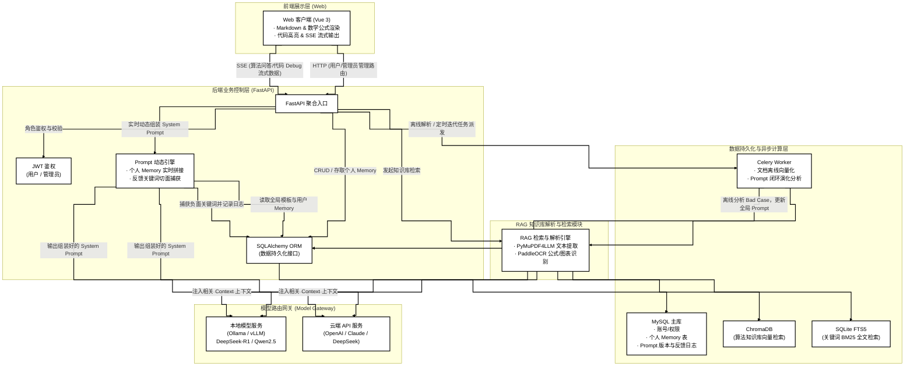
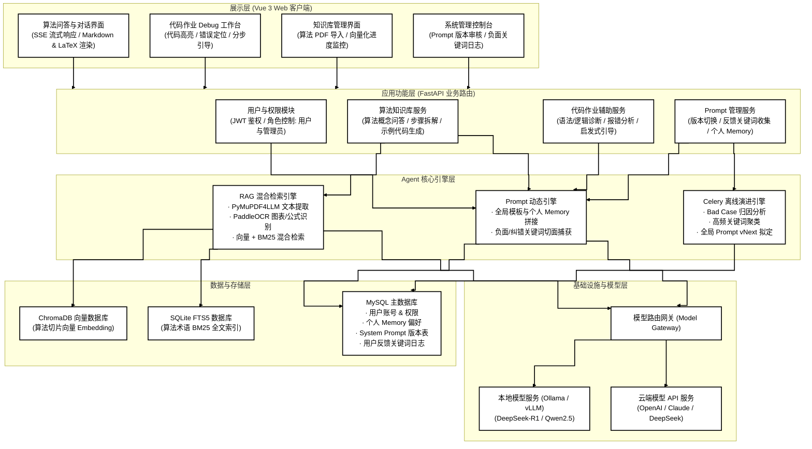
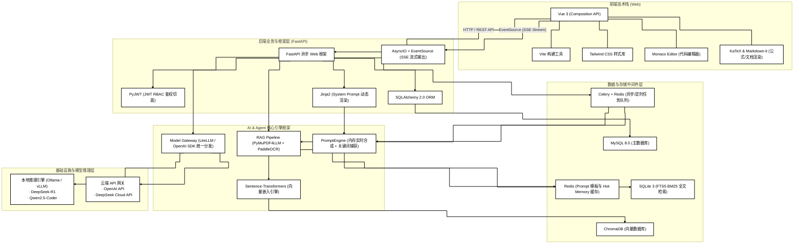

# 基于RAG技术的经典人工智能算法智能辅导与错误诊断辅助学习系统的概要设计说明书

**项目名称** 基于RAG技术的经典人工智能算法智能辅导与错误诊断辅助学习系统

**文档状态** []草稿文档

**当前版本** v1.0.0

**作者** PasteK0n

**完成日期** 

**版权所有** PasteK0n@github.com

---

# 修改历史

| 日期       | 版本   | 作者           | 修改内容                                                     | 评审号 | 更改请求号 |
| :--------- | :----- | :------------- | :----------------------------------------------------------- | :----- | :--------- |
| 2026-08-06 | V1.0.0 | PasteK0n       | 基本框架制定与内容撰写                             | R-001  | CR-001       |

---

## 目录

- [修改历史](#修改历史)
- [一、 引言 (Introduction)](#一-引言-introduction)
  - [1.1 编写目的](#11-编写目的)
  - [1.2 文档范围](#12-文档范围)
  - [1.3 参考资料](#13-参考资料)
- [二、系统总体设计 (System Total Design)](#二-系统总体设计-system-total-design)
  - [2.1 整体架构](#21-整体架构)
  - [2.2 整体功能架构](#22-整体功能架构)
  - [2.3 整体技术架构](#23-整体技术架构)
  - [2.4 运行环境设计](#24-运行环境设计)
  - [2.5 设计目标](#25-设计目标)
- [三、系统功能模块设计 (System Function Module Design)](#三-系统功能模块设计-system-function-module-design)
  - [3.1 个人办公](#31-个人办公)
  - [3.2 系统管理](#32-系统管理)
- [四、性能设计 (Performance Design)](#四-性能设计-performance-design)
- [五、接口设计 (API Design)](#五-接口设计-API-design)
  -[5.1 接口设计原则](#51-接口设计原则)
  -[5.2 接口实现方式](#52-接口实现方式)
- [六、数据库设计 (Database Design)](#六-数据库设计-database-design)
- [七、出错处理与可靠性设计 (Reliability & Fault-Tolerance)](#七-出错处理与可靠性设计-reliability-&-fault-tolerance)

---
## 一、引言
### 1.1 编写目的

本文档是“基于RAG技术的经典人工智能算法与错误诊断辅助学习系统”的概要设计说明书。编写文档的目的在于：

1. 设计系统整体架构，为开发者提供简洁明了的系统构成；
2. 设计系统功能模块、接口与数据库，达成目标功能；
3. 进行出错处理与可靠性设计，提高系统稳定性。

### 1.2 文档范围

本文档涵盖该AI搭建系统的构建过程，包括：

* **引言与总体设计**：项目设立初衷和系统整体架构设计
* **功能模块与性能设计**：不同用户界面包含功能，以及系统需要达到性能标准
* **接口、数据库与可靠性设计**：设计前后端交互接口、基于RAG的人工智能算法数据库，以及增强系统鲁棒性

### 1.3 参考资料

1.  GB/T 8567-2006《计算机软件文档编制规范》，中华人民共和国国家质量监督检验检疫总局，2006年
2.  ChromaDB 高维向量检索持久化规范：https://docs.trychroma.com/
3.  《Retrieval-Augmented Generation for Large Language Models: A Survey》, Tongxiang Fan, et al., 2023.

## 二、系统整体设计
### 2.1 整体架构

本系统面向个人自主学习与辅助，采用“前端 Web + 本地后端 + 本地/云端混合大模型”的架构。系统通过 FastAPI 整合 RAG（检索增强生成） 知识库与 代码作业辅助 Agent，并结合 Prompt 动态引擎 实现全局能力迭代与个人学习偏好记忆的实时合成。

### 2.2 整体功能架构

本系统实现以下功能：
1. 搭建基于RAG的人工智能经典算法数据库
2. Python代码辅助
3. Prompt动态合成与演化
4. Agent搭建与web界面前端展示

### 2.3 整体技术架构

本系统前端采用 Vue 3 + Vite + Tailwind CSS 搭配 SSE 实现响应式的 Markdown/LaTeX 渲染与代码流式输出；后端基于 FastAPI 搭建高并发路由并集成 JWT 权限控制，采用 Jinja2 实现“全局 Prompt 模板 + 用户 Memory”的动态合成；数据持久化由 MySQL + SQLAlchemy ORM 承载，配合 Redis + Celery 处理文档异步向量化与离线 Prompt 闭环演化分析；知识库检索整合 PyMuPDF4LLM + PaddleOCR 进行文档解析，采用 ChromaDB（向量检索）+ SQLite FTS5（BM25 全文检索） 的混合检索架构；模型层通过 Model Gateway 实现了对本地 Ollama（如 DeepSeek-R1 / Qwen2.5） 与外部云端 API 的无缝切换与统一调度。

