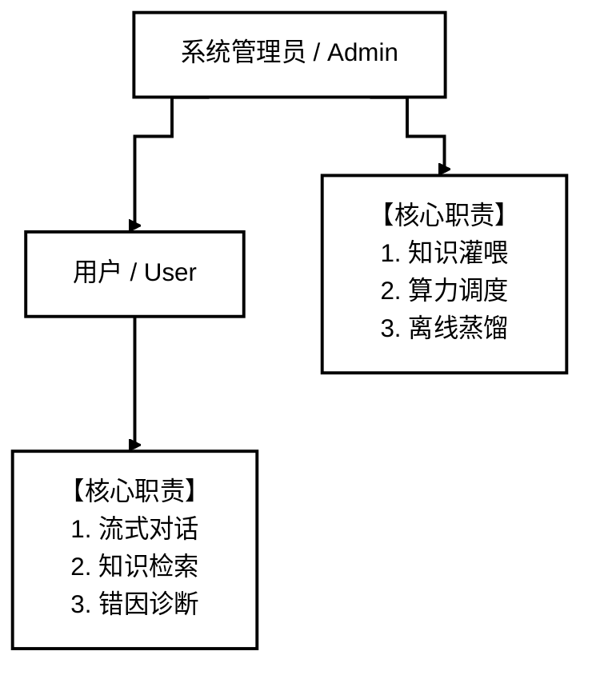
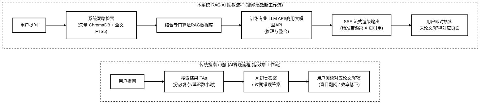
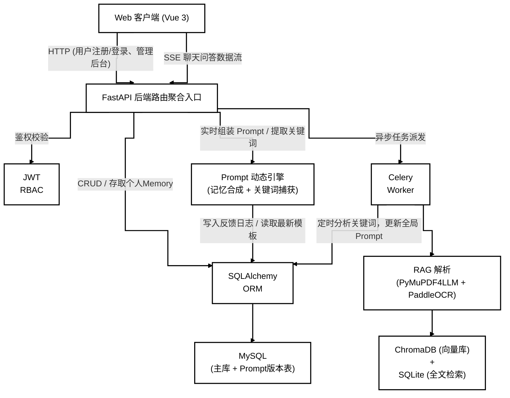

# 基于RAG技术的经典人工智能算法智能辅导与错误诊断辅助学习系统的需求分析

**项目名称** 基于RAG技术的经典人工智能算法智能辅导与错误诊断系统

**文档状态** []草稿文档

**当前版本** v1.0.0

**作者** PasteK0n

**完成日期**

**版权所有** PasteK0n@github.com

---

## 修改历史

| 日期       | 版本   | 作者           | 修改内容                                                     | 评审号 | 更改请求号 |
| :--------- | :----- | :------------- | :----------------------------------------------------------- | :----- | :--------- |
| 2026-07-04 | V1.0.0 | PasteK0n       | 需求分析大纲初稿编写与需求提取                              | R-001  | CR-001       |
| 2026-07-19 | V1.1.0 | PasteK0n       | 项目描述与用户环境描述                                       | R-002  | CR-002      |
| 2026-07-20 | v1.2.0 | PasteK0n       | 功能性需求分析                                               | R-003  | CR-003      |     
---

## 目录

- [修改历史](#修改历史)
- [一、 引言 (Introduction)](#一-引言-introduction)
  - [1.1 编写目的](#11-编写目的)
  - [1.2 文档范围](#12-文档范围)
  - [1.3 预期读者和阅读建议](#13-预期读者和阅读建议)
  - [1.4 参考资料](#14-参考资料)
- [二、 项目描述 (Project Description)](#二-项目描述-project-description)
  - [2.1 项目背景](#21-项目背景)
  - [2.2 项目名称](#22-项目名称)
  - [2.3 项目概述](#23-项目概述)
  - [2.4 项目关联性](#24-项目关联性)
  - [2.5 设计和实现上的限制](#25-设计和实现上的限制)
  - [2.6 假定条件和约束](#26-假定条件和约束)
  - [2.7 名词/术语解释](#27-名词术语解释)
- [三、 用户环境描述 (User Environment)](#三-用户环境描述-user-environment)
  - [3.1 用户单位组织结构](#31-用户单位组织结构)
  - [3.2 用户部门设置与职责](#32-用户部门设置与职责)
  - [3.3 用户业务关系描述](#33-用户业务关系描述)
  - [3.4 系统面向的用户群](#34-系统面向的用户群)
  - [3.5 关键计算机资源](#35-关键计算机资源)
  - [3.6 用户环境中的其他应用系统分布](#36-用户环境中的其他应用系统分布)
- [四、 功能性需求描述 (Functional Requirements)](#四-功能性需求描述-functional-requirements)
  - [4.1 用户当前的工作模式与痛点分析](#41-用户当前的工作模式与痛点分析)
  - [4.2 构建该系统的目标](#42-构建该系统的目标)
  - [4.3 功能结构划分与模块架构](#43-功能结构划分与模块架构)
  - [4.4 核心功能点需求细节](#44-核心功能点需求细节)
  - [4.5 接口需求](#45-接口需求)
- [五、 非功能性需求描述 (Non-Functional Requirements)](#五-非功能性需求描述-non-functional-requirements)
  - [5.1 系统环境需求](#51-系统环境需求)
  - [5.2 易用性和用户体验需求](#52-易用性和用户体验需求)
  - [5.3 软硬件技术需求](#53-软硬件技术需求)
  - [5.4 安全性需求](#54-安全性需求)
  - [5.5 可维护性需求](#55-可维护性需求)
  - [5.6 对培训的需求](#56-对培训的需求)
- [六、 其他与附录 (Appendix)](#六-其他与附录-appendix)
  - [6.1 软件应当遵循的标准或规范](#61-软件应当遵循的标准或规范)
  - [6.2 定义、首字母缩写词与缩略语](#62-定义首字母缩写词与缩略语)
  - [6.3 附件：用户需求调研表](#63-附件用户需求调研表)
---
## 一、引言
### 1.1 编写目的
本文档是“基于RAG技术的经典人工智能算法与错误诊断辅助学习系统”的需求规格说明书。编写文档的目的在于：

1. 详细梳理并规范多角色（客户、管理员）在使用该系统的功能性需求与非功能性需求；
2. 将普通电脑运行环境翻译为软件的技术边界，指导开发人员在本地环境（后可升级为无本地GPU的云服务器）下完成代码研发；
3. 为开发者进行系统集成测试、项目答辩及最终结项验收提供基准与依据，并作为后续维护阶段的参考指南。

### 1.2 文档范围
本文档覆盖该AI辅助学习系统的全部生命周期需求，包括：

*   **引言与项目背景**：系统立项初衷以及大模型时代下的人工智能经典算法学习诉求；
*   **用户环境描述**：学生层级关系、系统需要适配的计算机网络与宿主设备环境；
*   **功能性需求**：；
*   **非功能性需求**：轻量级环境并发承载能力、LaTeX 数学公式与 Markdown 渲染规范、数据库与向量数据的安全隔离机制及培训说明。

### 1.3 预期读者和阅读建议

*   **系统管理员**：重点阅读“第三章：用户环境描述”与“第四章：核心功能需求”，以便了解算法文档资源上传等具体操作边界；
*   **项目开发与测试人员**：需全文精读，尤其是“第四章”的功能步骤描述与“第五章”的非功能性指标（如 SSE 协议头、逻辑隔离与防止 XSS/SQL 注入），作为编码和用例设计依据；
*   **课程指导老师与项目验收组**：建议阅读“1.4 验收标准”、“4.2 构建系统的目标”及“5.3 技术选型”，评估项目是否达到立项预期和课程技术难度指标。

### 1.4 参考资料

1.  GB/T 8567-2006《计算机软件文档编制规范》，中华人民共和国国家质量监督检验检疫总局，2006年
2.  ChromaDB 高维向量检索持久化规范：https://docs.trychroma.com/
3.  《Retrieval-Augmented Generation for Large Language Models: A Survey》, Tongxiang Fan, et al., 2023.

## 二、项目描述
### 2.1 项目背景
在当今社会，学习人工智能算法的需求显著提高，但人工智能算法复杂晦涩难懂，学习者难以入手。在学习中遇到疑问时，人工答疑存在资源分布不均、实时性差等缺陷。而泛用性AI（如deepseek），无法对专业知识与具体案例进行专业分析与归纳，且面对特定概念时，极易出现
“AI幻觉”（胡编乱造，脱离大纲）。
为了解决该学习问题，本项目将检索增强技术（RAG）与web技术相结合，基于学校网络环境，通过将论文、课本导入数据库，设计本款可控制回答边界、回溯说明提供步骤与源码、并对提供的错误代码进行分析/报错/修改/意见的“AI经典算法学习助教”系统，来辅助日常AI算法学习。

### 2.2项目名称
基于RAG技术的AI经典算法助教系统  
*(英文全称：RAG-powered Algorithm Assistant for Education 简称：RAG-AlgoTA)*

### 2.3项目概述
本系统是面向AI算法初学者的轻量化智能辅助系统。系统核心解决的问题在“算法论文高精度解析”与AI幻觉问题。

系统分为三个部分：

1. **vue3现代化多段适配前端**：提供用户交互界面（逐字打印 SSE 渲染、Markdown 及行内/行间 LaTeX 数学公式解析、PDF 随文预览），与管理员轻量级后台。
2. **FastAPI 高并发异步后端**：管理 JWT 多角色 RBAC 访问权限拦截、对话状态历史以及大模型 API 的调用分发。
3. **Celery 异步文档解析引擎**：执行 PDF 的物理段落抽取、PaddleOCR 图像识别兜底、层级父子分块（Hierarchical parent-child chunking）、高维向量入库及会话摘要离线压缩。

### 2.4 项目关联性

*   **与现有教学系统的关联**：系统可独立作为日常辅助教学站，亦可预留标准 RESTful 接口对接外部大模型与网站，实现模型升级。
*   **对现有客户网络环境的影响**：系统部署于云端服务器后，API 逻辑层需发起外网 HTTPS 请求与商业模型提供商通信，客户端通过 Web 浏览器访问系统。
*   **长期影响**：构建低成本AI算法数据库，积累用户高频疑惑日志，为讲解侧重点提供基础。

### 2.5 设计和实现上限值

*   **算力与计算资源限制**：系统完全舍弃对本地昂贵 GPU 硬件的依赖。无论是大模型的推理过程还是向量维度的嵌入（Embedding），全部基于服务器训练模型API接入，以保障系统能部署在 2核4G 内存的云主机中。
*   **开发周期限制**：项目需在10月完成从需求、设计到部署联调的全部生命周期。
*   **存储与 I/O 限制**：ChromaDB 本地持久化需确保云主机的磁盘空间和 I/O 读写稳定性，避免高并发读取同一向量文件导致文件锁死或 IO 等待过高。

### 2.6 假定条件和约束

**假定条件（用户基础）**：假定用户具备日常操作主流 Web 浏览器及 AI 对话工具的基础计算机水平；假定用户上传的 PDF 教材大部分为清晰的电子排版，少数公式密集区或扫描件有适当的 OCR 识别容错预期。

### 2.7 名词/术语解释

*   **RAG (Retrieval-Augmented Generation)**：检索增强生成。一种在给大模型提问前，先从本地库检索出相关内容，作为上下文一同喂给大模型以防幻觉的技术。
*   **SSE (Server-Sent Events)**：服务器发送事件。一种基于 HTTP 协议的单向流式推送技术，用于实现 AI 回复时逐字打印的打字机效果。
*   **ChromaDB**：轻量化向量数据库。
*   **SQLite FTS5**：轻量关系库的全文索引模块，用于关键词检索。
*   **RRF (Reciprocal Rank Fusion)**：倒数排名融合算法。

## 三、用户环境描述
### 3.1 用户单位组织结构

系统组织架构模仿扁平化管理模式：

### 3.2 用户部门设置与职责

| 机构/部门/角色名称           | 职责描述                                                    | 备注说明                                   |
| :--------------------------- | :----------------------------------------------------------- | :----------------------------------------- |
| **用户**                     | 1.在前端与 Agent 进行实时交互，获取基于本地模型的即时、流式解答。 2. 上传代码文件，检查系统代码分析纠错功能。 3. 激活并调用特定知识库，对已存储的课件进行精准语义检索与溯源。|使用user账号，通过浏览器主聊天页面交互。|
| **系统管理员**               | 1.负责全系统的用户管理、注册审核、强制删除违规文件或敏感提问。 2.执行高负载的文档解析任务，将 PDF 课件转化为向量数据，构建核心知识库。 3.掌控系统算力分配，对模型进行灵活切换。 4. 管理与维护系统后台，定时对学情数据进行自动摘要压缩，维持系统性能与上下文的轻量化。| 管理员通过后台控制台与全局系统配置页维护。 |

### 3.3 用户业务关系描述

1. **账号审批关系**：用户创建账号后，管理员审批账号通过，用户账号密码信息存入用户数据库。
2. **资料生命周期**： 用户/管理员上传资料->管理员审批->后台离线解析->解析后成功写入数据库。
3. **对话审计关联**：用户对算法提问 -> 记录存入对话历史->系统保存相应单位出现次数。

### 3.4 系统面向用户群体

本系统受众是人工智能经典算法学习者，通常具备很高的移动端和电脑使用水平，追求即时响应和极简的类 ChatGPT 界面。他们期望 RAG 系统能够指出教材原文的具体页码，方便核验。

### 3.5 关键计算机资源

*   **云端部署资源**：要求宿主机支持标准 Docker 容器环境。MySQL 需要持久化挂载物理磁盘，由于向量库会写入高频数据，宿主机需预留 10GB 以上的存储空间。
*   **客户端资源**：用户仅需能接入互联网的常规电脑或智能手机，浏览器需支持现代 ES6 语法以及 Server-Sent Events 流解析接口。

## 四、功能性需求分析
### 4.1 用户当前工作模式与痛点分析
在引入本系统前，AI经典算法的学习过程如下：

* **工作流程**：学习者自学算法遇到困难->在网络搜索相关知识，阅读相关论文->无法系统归纳算法知识，学习效率低
* **核心痛点**：
  1. **过程繁琐**，搜索资料时间长，学习效率低；
  2. **缺乏归纳**，无法及时进行系统性总结；
  3. 直接询问通用大模型容易导致**AI幻觉**；
  4. 无法**迅速浏览**论文核心；

**当前模式与本系统对比**

### 4.2 构建该系统的目标
通过构建该系统，预计实现以下目标：
1. **管理目标**：规范知识层级化归档和鉴权，管理员轻松维护更新数据库与系统主prompt更新。
2. **使用目标**：实现 7×24h 毫秒级流式响应答疑，在 2核4G 低配机器上稳定支撑多班级日常并发提问。
3. **业绩目标**：

*   知识点检索定位时间从传统的几十分钟缩短至秒级；
*   通过双路检索配合 Prompt 强约束，将通用大模型在专业答疑中的“幻觉率”降低至 10% 以下。

### 4.3 功能结构划分与模型架构
系统功能架构划分为六个核心服务层，数据流和权限归属流转：

### 4.4 核心功能点需求细节
#### 4.4.1、 用户认证与角色分配
**业务描述**
